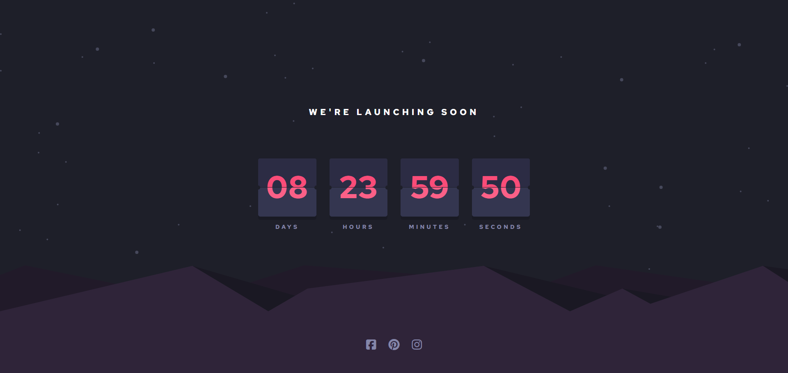

# Frontend Mentor - Launch countdown timer solution

This is a solution to the [Launch countdown timer challenge on Frontend Mentor](https://www.frontendmentor.io/challenges/launch-countdown-timer-N0XkGfyz-). Frontend Mentor challenges help you improve your coding skills by building realistic projects. 

## Table of contents

- [Overview](#overview)
  - [The challenge](#the-challenge)
  - [Screenshot](#screenshot)
  - [Links](#links)
- [My process](#my-process)
  - [Built with](#built-with)
  - [What I learned](#what-i-learned)
  - [Continued development](#continued-development)
  - [Useful resources](#useful-resources)
- [Author](#author)

## Overview

### The challenge

Users should be able to:

- See hover states for all interactive elements on the page
- See a live countdown timer that ticks down every second (start the count at 14 days)
- **Bonus**: When a number changes, make the card flip from the middle

### Screenshot



### Links

- Live Site URL: [Add live site URL here](https://jorge-sanchez09.github.io/launch-countdown-timer-main/)

## My process

### Built with

- Semantic HTML5 markup
- CSS custom properties
- Flexbox
- CSS Grid
- Mobile-first workflow
- JavaScript
- [TypeScript](https://www.typescriptlang.org/) - JS with syntax for types

### What I learned

I got a better understanding about responsive design without media queries by relying on css functions such as min() and clamp(). 
Initially, I struggled to create the animation for the card, but after watching a YouTube video, I found a solution and understood how to implement this feature

```html
<div class="container__card">
  <div class="card__top">00</div>
  <div class="card__bottom">00</div>
</div>
```
```css
.card__top, .card__top--flip, 
.card__bottom, .card__bottom--flip{
    position: absolute;
    padding-top: 0.4em;
    overflow: hidden;
}

.card__top, .card__top--flip{
    inset: 0 0 50%;
    color: hsl(from var(--clr-primary) h s calc(l - 0.04));
    background-color: var(--clr-neutral-700);
    border-bottom: 1px solid hsl(235, 16%, 14%);
}

.card__bottom, .card__bottom--flip{
    inset: 0;
    z-index: -1;
    background-color: var(--clr-neutral-600);
}

.card__top--flip{
    transform-origin: bottom;
    animation: 0.5s linear top-flip;
}

.card__bottom--flip{
    transform: rotateX(90deg);
    transform-origin: center;
    animation: 0.5s linear 0.5s bottom-flip;
}
```
```js
const flipCard = (flipCard, time) => {
    const timeStr = time.toString().padStart(2, '0');
    const currentValue = flipCard.querySelector('.card__top').textContent;
    if (timeStr == currentValue)
        return;
    const topFlipEl = document.createElement("div");
    topFlipEl.classList.add("card__top--flip");
    topFlipEl.innerText = currentValue;
    const bottomFlipEl = document.createElement("div");
    bottomFlipEl.classList.add("card__bottom--flip");
    bottomFlipEl.innerText = timeStr;
    const topHalfEl = flipCard.querySelector(".card__top");
    const bottomHalfEl = flipCard.querySelector(".card__bottom");
    topFlipEl.addEventListener("animationstart", () => {
        topHalfEl.textContent = timeStr;
    });
    topFlipEl.addEventListener("animationend", () => {
        topFlipEl.remove();
    });
    bottomFlipEl.addEventListener("animationend", () => {
        bottomHalfEl.innerText = timeStr;
        bottomFlipEl.remove();
    });
    flipCard.appendChild(topFlipEl);
    flipCard.appendChild(bottomFlipEl);
};
```

### Continued development

I wrote my code using TypeScript for practice, and I hope to keep learning more about this language

### Useful resources

- [Youtube](https://www.youtube.com/watch?v=_ZAWOK18jmU&t=3s) - This helped me to implement the animations for the cards and understand what's going on behind 


## Author

- Frontend Mentor - [@Jorge-sanchez09](https://www.frontendmentor.io/profile/Jorge-sanchez09)